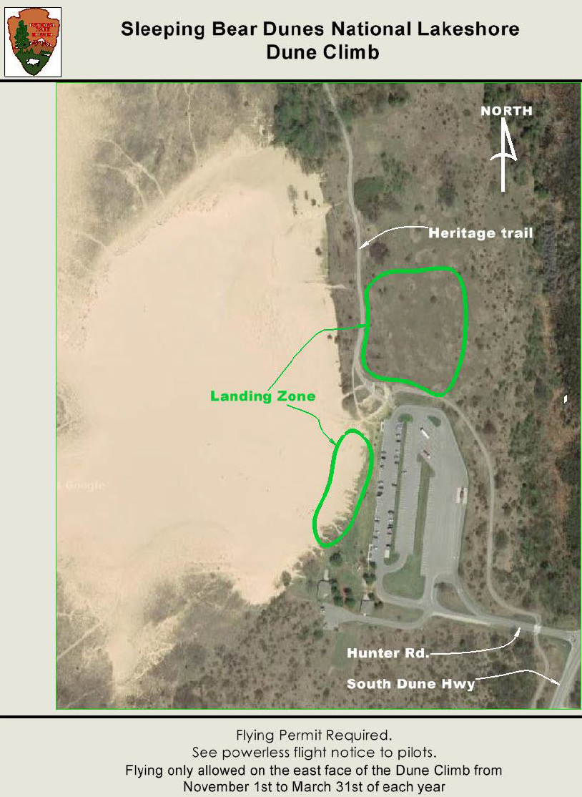

************************************************
Dune Climb
************************************************

Overview TBD

* Owner: National Park Service
* Fees: None.
* Permit: NPS issues one annual permit for all sites at the `Philip Hart Visitor Center <https://www.google.com/maps/place/Philip+A.+Hart+Visitor+Center/@44.8116366,-86.058379,17z/data=!3m1!4b1!4m5!3m4!1s0x881e1af9c6058f8f:0xf4e22c9117e103ea!8m2!3d44.8116328!4d-86.0561903?hl=en&authuser=0>`_.
* Understand the weather and learn about :ref:`eval`.
* `PDF Map <duneclimbmap.pdf>`_

Details
=====================

Flying is limited to 5 gliders at a time. Hand-carry gliders only. 

Hang gliding or paragliding is allowed on the east face of the Dune Climb from November 1 to March 31 of each year. Activities will be limited to tμe sand areas of the dune that do not have vegetation. Landings will take place either on top of the Dune Climb or in the grass area below the Dune Climb.

.. raw:: html

            <section id="motor-database">

                
<a class="reference external"
                    href="https://docs.google.com/spreadsheets/d/1YxBgLFgAPA1eecVj8pd3vcZd0Cz_Ptz4RYHWJPVGo7w/edit?usp=sharing">Edit
                    or copy this data</a> 

                <!-- Table sorter -->
                <table class="blueTable">
                  <thead id="table-head"></thead>
                  <tbody id="table-body"></tbody>
                </table>
                <!-- Table -->

                <!-- MDB ESSENTIAL -->
                
                <!-- Google API -->
                
                <!-- easyData -->
                

                <!-- easyData - Creating table -->
                

              </section>

Photos
=================================

tbd
