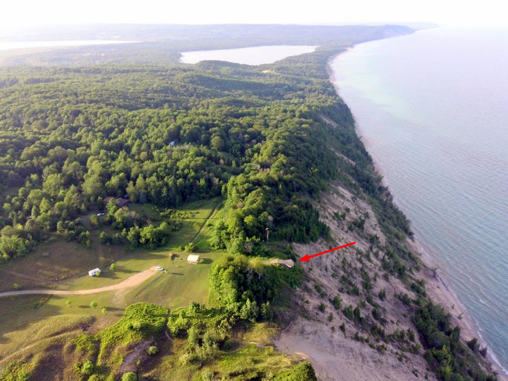

************************************************
Greenpoint
************************************************

TBD 

The campground is awesome. 

The HG ramp is not self-launch friendly and usually requires wire help. 

The PG launch is a dune swale that is partly on neighboring property. Until there's an issue, launching to the West is no problem. GFA property only allows for a NW launch.

* Pay the fees (can be done onsite).
* `Know the GFA regulations <GreenpointRegulations.pdf>`_.
* Understand the weather and learn about :ref:`eval`.

Directions
=================
              

Details
====================

.. raw:: html

            <section id="motor-database">

                
<a class="reference external"
                    href="https://docs.google.com/spreadsheets/d/1O1r8choAQuhgh6FGf203ebjBLAv3VeXi2KZuJlWuQi4/edit?usp=sharing">Edit
                    or copy this data</a> 

                <!-- Table sorter -->
                <table class="blueTable">
                  <thead id="table-head"></thead>
                  <tbody id="table-body"></tbody>
                </table>
                <!-- Table -->

                <!-- MDB ESSENTIAL -->
                
                <!-- Google API -->
                
                <!-- easyData -->
                

                <!-- easyData - Creating table -->
                

              </section>

Photos
==========================

