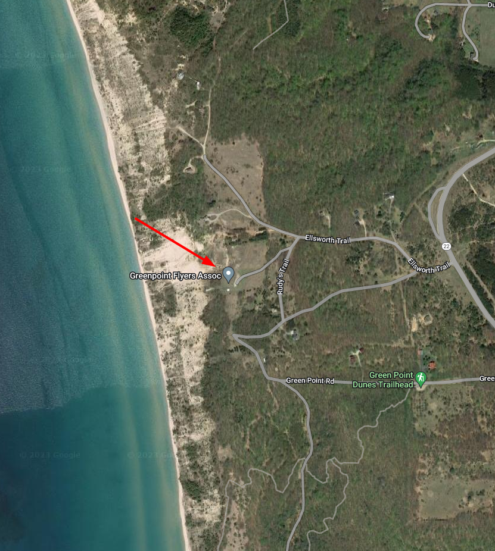

************************************************
Greenpoint
************************************************

The Greenpoint flying site is maintained by the Greenpoint Flyers Association (GFA). The site includes launches for HG and PG as well as a nice campground with water, electricity, and an outhouse. 

GFA is a private, for-profit corporation where each shareholder is a landowner. GFA has generously maintained this site for decades. They have also acted as a liaison with the National Park Service. 

The HG ramp is not self-launch friendly as it is a flat, narrow ramp that juts out over the bluff. Thereby allowing strong wingtip lift which usually requires wire help. The beach LZs are usually quite narrow, so the preferred destination is 1.5 miles to the north and the large Elberta beach. Elberta is almost always doable, but pilots would be wise to keep in mind that a narrow beach landing is the only alternative if there is an issue.

The PG launch is a dune swale that faces roughly west. Landing on top is possible in some locations, but most pilots choose the beach and hike up if they have not made Elberta. 

* Owner: Greenpoint Flyers Association
* Fees: Day, month, and yearly passes
* `GFA regulations <GreenpointRegulations.pdf>`_.
* Understand the weather and learn about :ref:`eval`.

Details
====================

.. raw:: html

            <section id="motor-database">

                
<a class="reference external"
                    href="https://docs.google.com/spreadsheets/d/13TjBa0W4AJ3GwWZfhOYba3IDddCQI7ox6W3VpFw3wZY/edit?usp=sharing">Edit
                    or copy this data</a> 

                <!-- Table sorter -->
                <table class="blueTable">
                  <thead id="table-head"></thead>
                  <tbody id="table-body"></tbody>
                </table>
                <!-- Table -->

                <!-- MDB ESSENTIAL -->
                
                <!-- Google API -->
                
                <!-- easyData -->
                

                <!-- easyData - Creating table -->
                
              </section>

Video
==================

.. raw:: html

  <iframe width="560" height="315" src="https://www.youtube.com/embed/RUQiH4GCDhs" title="YouTube video player" frameborder="0" allow="accelerometer; autoplay; clipboard-write; encrypted-media; gyroscope; picture-in-picture; web-share" allowfullscreen></iframe>
  
Photos
==========================

.. image:: images/greenpoint1.png

