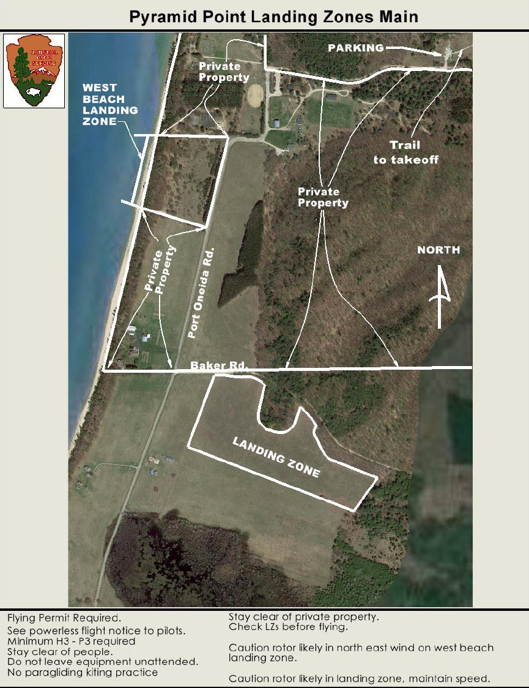

************************************************
Pyramid Point
************************************************

Overview TBD

* Owner: National Park Service
* Fees: None.
* Permit: NPS issues one annual permit for all sites at the `Philip Hart Visitor Center <https://www.google.com/maps/place/Philip+A.+Hart+Visitor+Center/@44.8116366,-86.058379,17z/data=!3m1!4b1!4m5!3m4!1s0x881e1af9c6058f8f:0xf4e22c9117e103ea!8m2!3d44.8116328!4d-86.0561903?hl=en&authuser=0>`_.
* Understand the weather and learn about :ref:`eval`.
* `PDF Map <pyramidpointmap.pdf>`_

Details
====================

Flying is limited to 5 gliders at a time. Carts may be used to transport gliders.

All flights at Pyramid Point will be initiated from the blowout at the top of the bluff. All pilots landing on the beach below Pyramid Point will exit the area via the trail that ends at the east end of the dune area. The face of the bluff will be avoided and will not be climbed. Pilots may also land in the field east of the Klett Farm or in the field that is south of Baker Road and east of Port Oneida Road.

.. raw:: html

            <section id="motor-database">

                
<a class="reference external"
                    href="https://docs.google.com/spreadsheets/d/1rKDSa2vtXpZv6oLBb6BPHeFEZU1INiJS1_VSzBNVE00/edit?usp=sharing">Edit
                    or copy this data</a> 

                <!-- Table sorter -->
                <table class="blueTable">
                  <thead id="table-head"></thead>
                  <tbody id="table-body"></tbody>
                </table>
                <!-- Table -->

                <!-- MDB ESSENTIAL -->
                
                <!-- Google API -->
                
                <!-- easyData -->
                

                <!-- easyData - Creating table -->
                

              </section>

Photos
==========================

tbd
