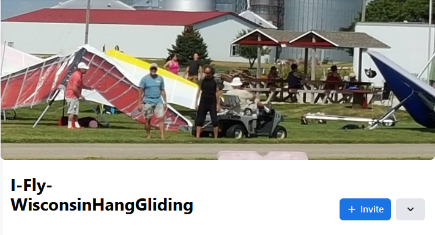
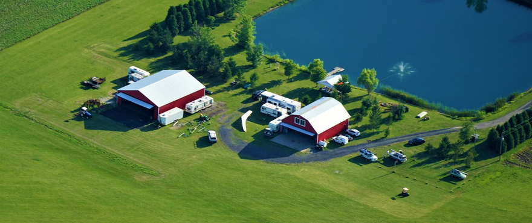
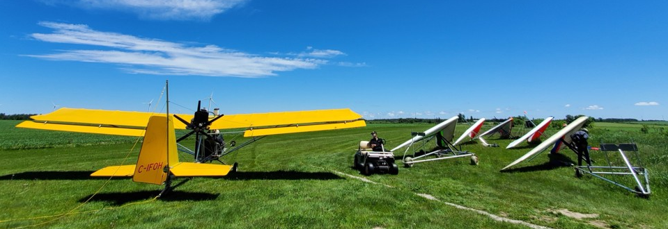
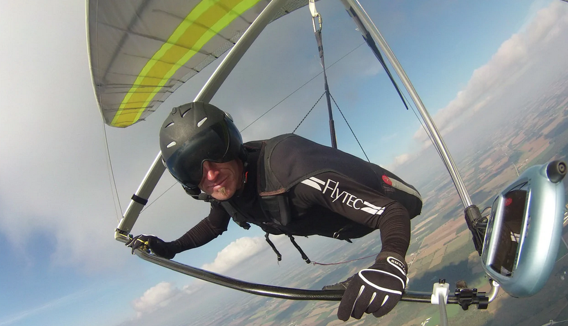

************************************************
Midwest Tow Locations
************************************************

.. note:: If you want to add here, make the request at https://www.facebook.com/groups/michigangliding

.. image:: images/uc2.gif

Overview
===============

This page lists known midwest tow parks and may eventually list airfields that allow towing. 

Wisconsin Hang Gliding Club
===============================

Danny and Karen run a great tow op out of Whitewater, WI. It's as much a club as a business, so expect a laid-back atmosphere and nice camaraderie. 100 miles flights are common during XC season.

They are usually open 7 days a week. They move the operation to Arizona for the winter. 

Amenities: 

* Two long, grassy strips w/ launches in 4 directions
* Small training hill 
* Hanger, small store, carts at the ready
* Camping, showers, fire pit, picnic tables
* Close to town

https://www.facebook.com/groups/439245389598036

Weather resources
-------------------------

Provided by the locals: 

* https://ryancarlton.com/Whitewater,%20WI 
* http://www.usairnet.com/cgi-bin/launch/code.cgi?Submit=Go&sta=KJVL&state=WI 
* https://www.accuweather.com/en/us/whitewater/53190/weather-radar/2249455

Hang Glide Chicago
===============================

I haven't been there yet, so I can only post their website link. You find details at: https://hangglidechicago.com/. 

They normally run a weekend-only show. 

SOGA
==================

http://www.sogaclub.ca/

 Located 20 minutes north of Orangeville, in prime thermal territory. Aerotowing to 2000 feet, then releasing to soar higher and further. The ideal location geographically and airspace wise to fly cross country in any direction. Typical hang gliding flights of 2 hours with potential of 5 hours and 250km. Using the latest aerotowing techniques and equipment to provide the safest, most enjoyable hang gliding experience possible. Flying weekends and some weekdays. 

Instinct Wind Sports
===============================

https://instinct.pro/en-us/pages/about-us

Airfields
============

* Thompsonville, Michigan: Was once a tow site. Probably still available.
* Other Northern Michigan strips: There are many. 

