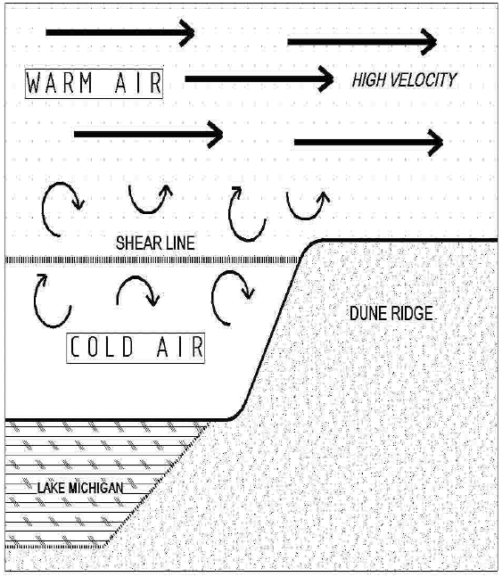

************************************************
Weather page
************************************************

This page specifically targets sites in the greater Traverse City area: Sleeping Bear Dunes, Greenpoint, Acadia, Empire, and Pyramid Point.

Weather resources
=================================

It's a good idea to compare all the reported wind conditions below. 

* Windy: `Direction, speed, and forecast <https://www.windy.com/?44.628,-86.200,11>`_
* NOAA Buoy: `Offshore wind (removed in winter) <https://www.ndbc.noaa.gov/station_page.php?station=45002&fbclid=IwAR3TVu2dXanHPiR5DH7GFNMYzbVNCqY_XZuU0H0M1zifWcq2FqCoufyxlTk>`_ reading several miles away
* Elberta pier: `Current wind <https://sailflow.com/map#44.592,-86.21,11,1>`_
* Elberta airport: `Current wind <https://wind.willyweather.com/mi/benzie-county/elberta.html>`_
* Water temperature: `Cold water near launch <http://www.coastwatch.msu.edu/michigan/m2.html>`_ can alter the prevailing wind direction when a cold water blob parks offshore. 
* Weather Underground real-time spot stations. These stations often go offline, but there are usually nearby stations.  

  * `Empire <https://www.wunderground.com/weather/us/mi/empire>`_
  * `Elberta and Frankfort <https://www.wunderground.com/weather/us/mi/frankfort/KMIFRANK54>`_

.. raw:: html

        <iframe width="850" height="650"
        src="https://embed.windy.com/embed2.html?lat=44.764&lon=-85.957&detailLat=50.017&detailLon=-85.963&width=850&height=650&zoom=9&level=surface&overlay=wind&product=ecmwf&menu=&message=&marker=&calendar=now&pressure=&type=map&location=coordinates&detail=&metricWind=mph&metricTemp=%C2%B0F&radarRange=-1"
        frameborder="0"></iframe>

.. _eval:

Evaluating Conditions
======================================

While NW Michigan dune flying is often user-friendly, spring and summer months occasionally see temperature differentials between the lake and flying zone that can create turbulence and an illusion of soarable conditions. Warm land air coming across from Wisconsin rides up and over the colder dense air of Lake Michigan. This condition can occur when the temperature difference is as low as 5-10 degrees. The larger the temperature difference, the greater the flying risk. As shown in the diagram below, the resulting shear line generally has turbulence below and significantly stronger winds above. Sometimes this line is positioned just below launch and apparent soarable launch conditions may actually mask a small lift vector where only the upper portion of the bluff is in the lift zone. In this situation, pilots may find themselves sinking in turbulent air with minimal control. 

If the shear line is lower on the bluff, the pilot may be able to soar but could be quickly lifted into a stronger wind zone than what was measured at launch. Paragliders can lose penetration and find themselves in rotors behind launch. It is important to watch soaring birds to help evaluate the possibility of a temperature gradients. If the streamers lower on the bluff are at odd directions and/or the birds below launch are flapping or being rocked by turbulence while birds above launch are easily soaring, it may be wise to skip flying. 

Other indicators of a significant temperature difference between the water and the air include: 

* The wind on launch is 12+ mph, and there are no whitecaps on the lake surface. 
* There is a noticeable change in lake texture between near shore and approximately 300 or more feet from shore. 
* There is a `cold water blob near launch <http://www.coastwatch.msu.edu/michigan/m2.html>`_.

These conditions send you quickly to the beach or push you into the side of the bluff or Lake Michigan.

